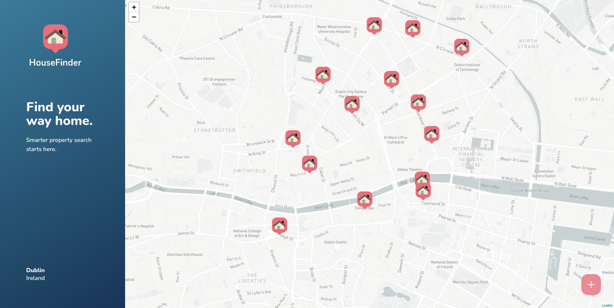
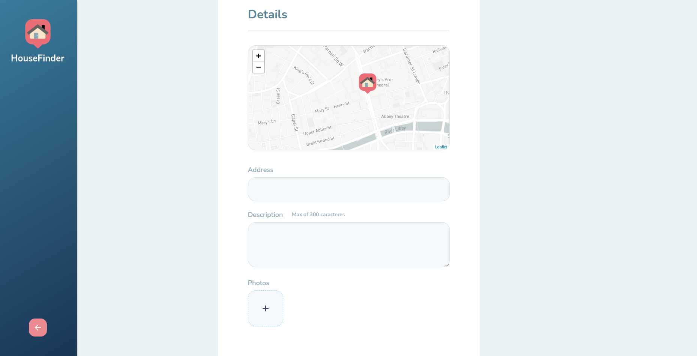
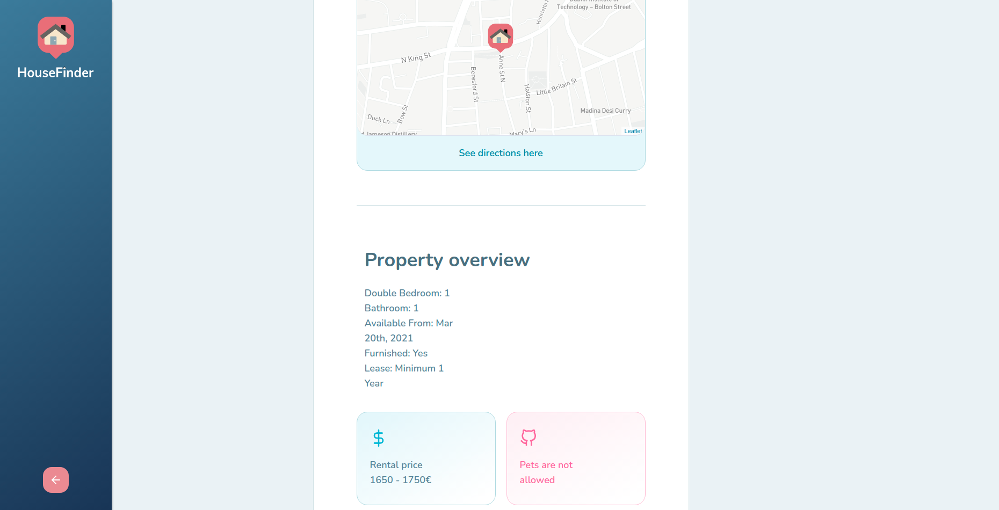
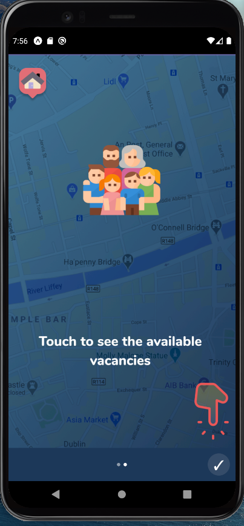
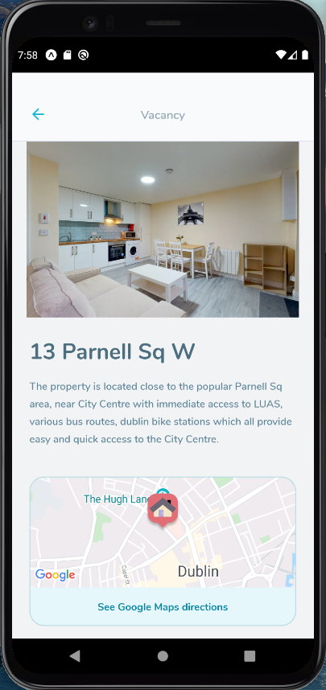
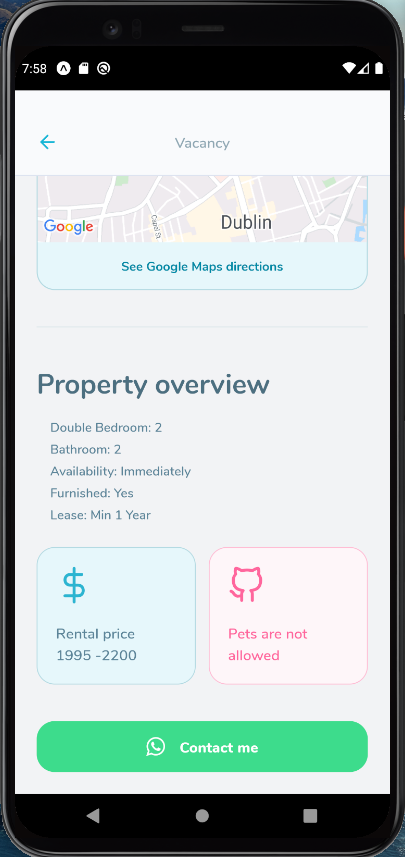
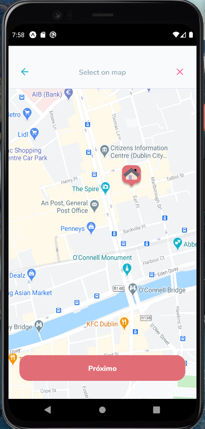
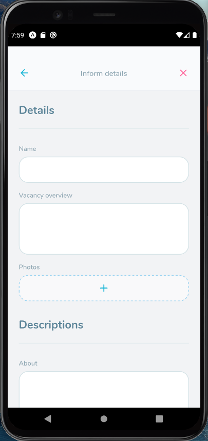

<h1 align="center">
  
</h1>

<strong>
<br>
<p align="center">
  <a href="#bookmark-about">About</a>&nbsp;&nbsp;&nbsp;|&nbsp;&nbsp;&nbsp;
  <a href="#computer-technologies">Technologies</a>&nbsp;&nbsp;&nbsp;|&nbsp;&nbsp;&nbsp;
  <a href="#wrench-tools">Tools</a>&nbsp;&nbsp;&nbsp;|&nbsp;&nbsp;&nbsp;
  <a href="#package-installation">Installation</a>&nbsp;&nbsp;&nbsp;|&nbsp;&nbsp;&nbsp;<a href="#camera_flash-screenshots">Screenshots</a>&nbsp;&nbsp;&nbsp;|&nbsp;&nbsp;&nbsp;
  <a href="#memo-license">License</a>
</p>
</strong>
<br>

<p align="center">
    
</p>

## :bookmark: About

**HomeFinder** is a **.

<br>

## :computer: Technologies

-  **[Typescript](https://www.typescriptlang.org/)**
-  **[Node.js](https://nodejs.org/)**
-  **[Express](https://expressjs.com/)**
-  **[TypeORM](https://typeorm.io/)**
-  **[SQLite](https://www.sqlite.org/)**
-  **[ReactJS](https://reactjs.org/)**
-  **[React Native](http://facebook.github.io/react-native/)**
-  **[Expo](https://expo.io/)**
-  **[Axios](https://github.com/axios/axios)**

<br>

## :wrench: Tools

- **[VisualStudio Code](https://code.visualstudio.com/)**
- **[Insomnia](https://insomnia.rest/)**
- **[Google Chrome](https://www.google.com/chrome/)**
- **[DBeaver](https://dbeaver.io/)**

<br>

## :package: Installation

### :heavy_check_mark: **Prerequisites**

The following software must be installed:
  
  - **[Node.js](https://nodejs.org/en/)**
  - **[Git](https://git-scm.com/)**
  - **[NPM](https://www.npmjs.com/)** or **[Yarn](https://yarnpkg.com/)**
  - **[Expo](https://expo.io/)** 
  - **[Expo App](https://play.google.com/store/apps/details?id=host.exp.exponent)**

<br>

### :arrow_forward:	**Running the applications**

- :package: API

```sh
  $ cd backend
  # Dependencies install.
  $ yarn # or npm install
  # Data base creation.
  $ yarn typeorm migration:run # or npm run typeorm migration:run
  # API start
  $ yarn dev # or npm run dev
```

- :computer: Web app

```sh
  $ cd web
  # Dependencies install.
  $ yarn # or npm install
  # Running web app
  $ yarn start # or npm start
```

- :android: Mobile app

```sh
  $ cd mobile
  # Dependencies install.
  $ yarn # or npm install
  # Running mobile app
  $ yarn start # or npm start
```

<br>

## :camera_flash: Screenshots

- Web







- Mobile


&nbsp;&nbsp;&nbsp;&nbsp;&nbsp;&nbsp;&nbsp;

<br>

## :memo: License

